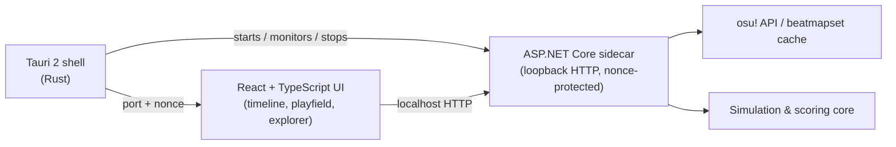

# osu! Replay Editor

A Windows desktop editor for osu!standard replays: import one or more `.osr` files,
edit cursor movement and key presses on a timeline, resimulate the score against
osu!(lazer) scoring rules, and save everything as a project you can reopen later.

## Features

- **Replay import & editing** — load several `.osr` files against the same beatmap,
  edit cursor paths and M1/M2/K1/K2 key timing directly on the timeline, cut/blade
  inputs, and undo/redo every change.
- **Multi-map projects** — switch the active beatmap without losing previously
  imported replays; each map's replays stay grouped and reachable from the Explorer.
- **Project files (`.oreproj`)** — a single file captures every track, its edits,
  the active beatmap, and view/display preferences.
- **Beatmap viewer** — a PixiJS-rendered playfield with circles, sliders,
  spinners, hidden/approach fades, and cursor trails, driven by the same clock as
  the timeline.
- **Score resimulation** — recompute accuracy, combo, and judgements after an
  edit, matching osu!(lazer) slider and scoring behaviour.
- **osu! account integration** — sign in to resolve and download the exact
  matching beatmap difficulty for an imported replay, with cached beatmapsets for
  offline reuse.

## Architecture



The frontend never talks to the osu! API directly: the Tauri shell launches a
local ASP.NET Core sidecar on a random loopback port and hands the frontend a
one-time nonce, which the sidecar requires on every request. The sidecar owns
replay parsing, beatmap resolution/caching, authentication, and score
simulation; the UI is presentation and editing only.

## Requirements (Windows)

- Node.js 24 and npm 11
- .NET SDK 10
- Rust MSVC toolchain (`x86_64-pc-windows-msvc`)
- Microsoft Edge WebView2 Runtime and the Windows build tools required by Tauri 2

## Getting started

```powershell
npm install
npm run dev
```

`npm run dev` builds the sidecar, copies it into `apps/desktop/src-tauri/binaries`,
starts Vite, and launches the Tauri window. The first Rust build can take a few
minutes.

osu! OAuth credentials can be provided either as environment variables or in a
local config file (never commit real values):

```powershell
$env:OSU_CLIENT_ID = '<client id>'
$env:OSU_CLIENT_SECRET = '<client secret>'
```

or copy `app.config.example.json` to `app.config.json` and fill in `osu.clientId`
/ `osu.clientSecret`.

### Other useful commands

```powershell
npm run check         # TypeScript project check
npm run build          # release sidecar + Tauri package
npm run test:viewer    # frontend/unit tests (node:test)
npm run test:replay    # replay import smoke tests
npm run test:simulation
dotnet build ReplayEditor.slnx
```
